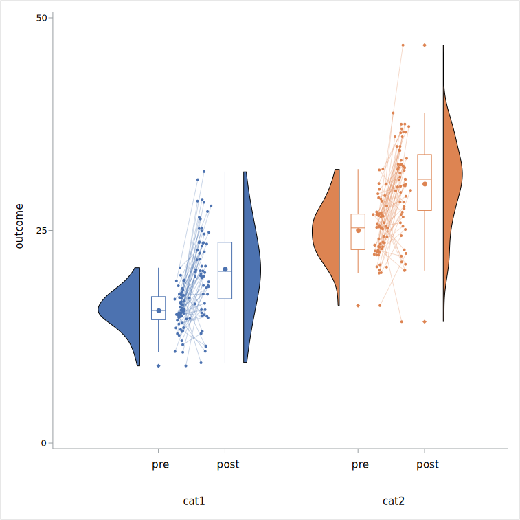

#######################################
Raincloud plot (paired)
#######################################

***************
What's this?
***************

Macro for generate paired raincloud plot using SAS GRAPH.

this macro is useful for display raincloud plot of repeated measure study.
number of replicate should be two.

the density plot of the second replicate is flipped horizontal.

spaghetti plot (individual tracings for each subject ) can be overlaid on the raincloud plot.

*****************
Input data
*****************

.. csv-table:: 

   "**key**", "**variable** ", "**type**"
   "1","category","numeric or string"
   "2", "repeat", "repeat ID, numeric or string"
   "3","group", "numeric or string"
   "", "subject", "subject ID "
   "","response", "numeric"

group variable is optional. 

I recommended that the variable type of category , "replicate" and group are set to numeric with format.
if the variable type is string, item order is defined as acending character order.

***************
Syntax
***************

 ::

   ods graphics / < graphics option > ;
   ods listing gpath=< output path >;

    %RainCloudPaired(
		 data=,
		 x=,
		 y=,
		 repeat=,
		 subject=,
		 group=None,
		 yticks=, 
		 ylabel=y,
		 cat_iv=1.6,
		 element_iv=0.4,
		 scale=area,
		 trim=True,
		 connect=False,
		 spaghetti=True,
		 gridsize=401,
		 bw_method=sjpi,
		 bw_adjust=1,
		 orient=v, 
		 legend=false,
		 jitterwidth=0.05,
		 outlinewidth=1);
		 

***************
Parameters
***************
- **data : dataset name (required)**

   input data. keep, rename and  where options are available.

- **x : variable name (required)**

   category variable

- **y : variable name (required)**

   response variable

- **repeat : variable name (required)**

    repeat ID , the number of repeat should be two.
    if other, this macro will be stopped.

- **subject : variable name (required)**

    subject ID 

- **group : variable name (optional)**

   group variable for grouping data at each category.

   when the parameter is not set, all of graph object is set same color.

   when the parameter is set category variable, the graph object of rach category is 
   set  different color.

   default is "None".

- **ylabel : string (optional)**

   label string of response axis.
   default is "y". when the label is not displayed , set like below.

   ylabel=,

- **yticks : numeric list (required)**

   tickvalue list of response axis.
   the list is set as the numeric list separated by space .
   the item of the list should be set ascending order.

   ex. yticks = 10 20 30 40,

- **cat_iv : numeric (optional)**

   the interval of category.
   the default is 1.6

- **element_iv : numeric (optional)**

   the interval of density plot, boxplot and strip plot.
   the default is 0.4.

- **scale: area or width (optional)**

    The method used to scale the width of each density plot.

    If area, each plot will have the same area. 
    If width, each plot will have the same width.

    when the density plots are far different each other, width keyword may be useful.
    the default is "area".

- **trim: bool (optional)**

    if True the density outside of observed data range will be trimmed.
    the default is "True".

    If area, each plot will have the same area. 
    If width, each plot will have the same width.

    when the density plots are far different each other, width keyword may be useful.

- **connect: bool (optional)**

    if True the mean values in same group are connected by solid line.
    the default is "False". 

- **spaghetti: bool (optional)**

    if True spaghetti plot is displayed. values each subject is connected by solid line.
    the default is "True". 

- **gridsize : integer (optional)**

   the number of KDE gridsize.
   default is 401 (the default of proc kde)

- **bw_method : keyword (optional)**

   the bandwidth estimation method of KDE.
   default is "sjpi" (the default of proc kde).

   method keyword described below is available.

      * sjpi (Sheather-Jones plug-in)
      * snr (simple normal reference)
      * snrq (simple normal reference that uses the interquartile range)
      * srot (Silverman's rule of thumb)
      * os (oversmoothed)

- **bw_adjust : numeric (optional)**

   the bandwidth multiplier. Increasing will make the curve smoother.

   the default is 1. 

- **legend : bool (optional)**

   if "True" the legend of group item is displayed.
   if group parameter is "None", the parameter will be ignored.

   default is "False".

- **orient : v or h (optional)**

    Orientation of the plot (vertical or horizontal). 

    the default is "v".

- **jitterwidth : numeric(between 0 and 1) (optional)**

    jitter width of strip plot. Increasing this parameter may be made the data point overlapped on boxplot.

    the default is "0.05".

- **outlinewidth : numeric (optional)**

    outline width of density plot and boxplot.

    the default is "1".

***************
example
***************

Simple paired raincloud plot
==============================

datasets (ds1)

.. csv-table:: 

   "**variable** ", "**detail**"
   "cat","category, 1=cat1 2=cat2"
   "repeat", "repeat iD, 1=Pre 2=Post"
   "value","outcome"
   "usubjid","subject ID"

code ::

    ods graphics / reset=all imagefmt=svg imagename="rainpair_simple" width=20cm height=20cm;
    ods listing gpath="/home/user/sasuser.v94/GTL/image" style=sns_default ;
    %RainCloudPaired(
            data=ds1,
            x=cat,
            y=value,
            repeat=repeat,
            subject=usubjid,
            group=cat,
            yticks=0 25 50, 
            ylabel=outcome,
            cat_iv=1.6,
            element_iv=0.45,
            jitterwidth=0.05);

output

when orient parameter is set "h", the orientation of plot is changed horizontal (x=response, y=category)

.. image:: ./img/rainpaired_simple_h.svg

    
Grouped raincloud plot
=======================
datasets (ds2)

.. csv-table:: 

   "**variable** ", "**detail**"
   "cat","category, 1=cat1 2=cat2"
   "repeat", "repeat iD, 1=Pre 2=Post"
   "type", "group, 1=type1 2=type2"
   "value","outcome"
   "usubjid","subject ID"

code ::

    ods graphics / reset=all imagefmt=svg imagename="rainpaird-group" width=20cm height=15cm;
    ods listing gpath="/home/user/sasuser.v94/GTL/image" style=sns_default ;
    %RainCloudPaired(
		 data=ds2,
		 x=cat,
		 y=value,
		 repeat=repeat,
		 subject=usubjid,
		 group=type,
		 yticks=10 20 30 40 50 60 70 , 
		 ylabel=outcome,
		 cat_iv=1.6,
		 element_iv=0.45,
		 orient=h, 
		 legend=true);

output

.. image:: ./img/rainpaird_group.svg

Connect parameter
=======================

If connect parameter is set "True", means of each group will be connected.

code ::

    ods graphics / reset=all imagefmt=svg imagename="rainpaird_group_connect" width=20cm height=20cm;
    ods listing gpath="/home/centraldogma7771/sasuser.v94/GTL/image" style=sns_default ;
    %RainCloudPaired(
		 data=ds2,
		 x=cat,
		 y=value,
		 repeat=repeat,
		 subject=usubjid,
		 group=type,
		 yticks=10 20 30 40 50 60 70 , 
		 ylabel=outcome,
		 cat_iv=1.6,
		 element_iv=0.45,
		 connect=True,
		 spaghetti=False,
		 orient=v, 
		 legend=true);

output

.. image:: ./img/rainpaird_group_connect.svg
